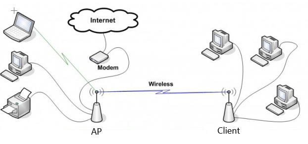

# Why

## Why we need the client bridge mode?

Because we want to connect a network segment behind the wireless client to the network segment of the wireless AP. The typical scenario is shown below.

## Client bridge mode issues

